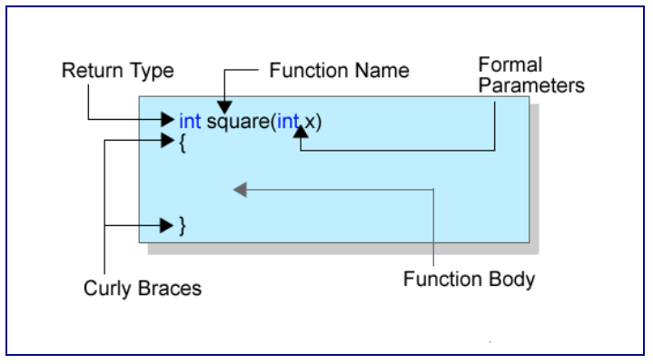
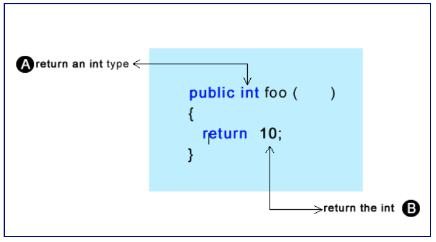
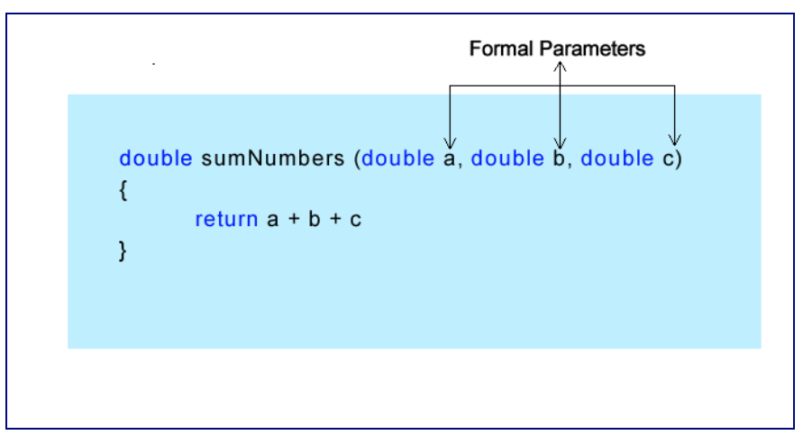
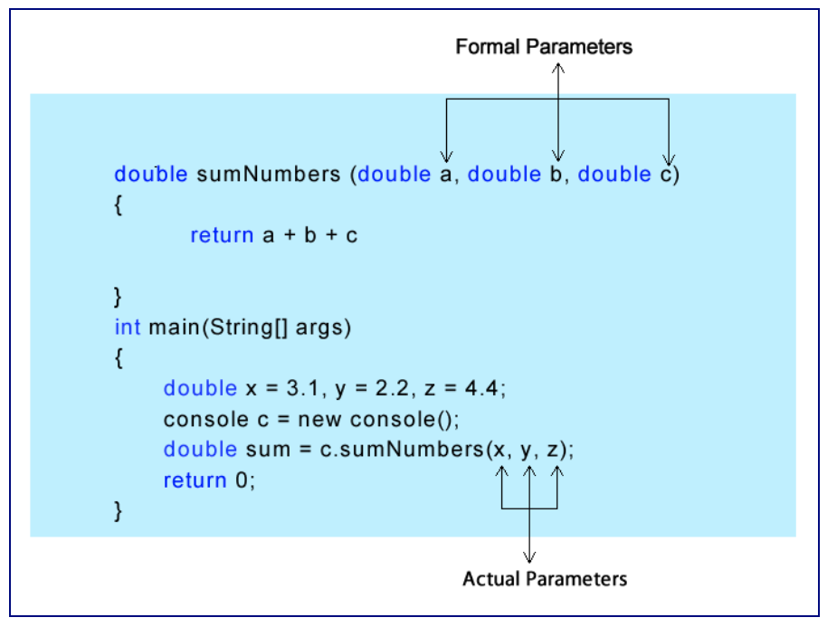
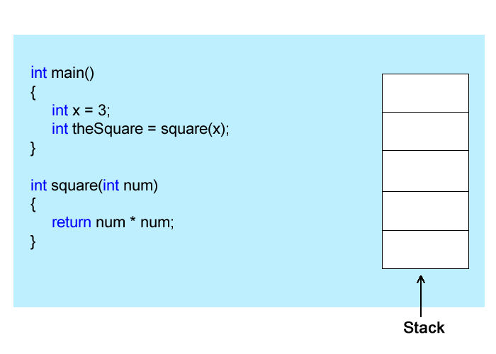
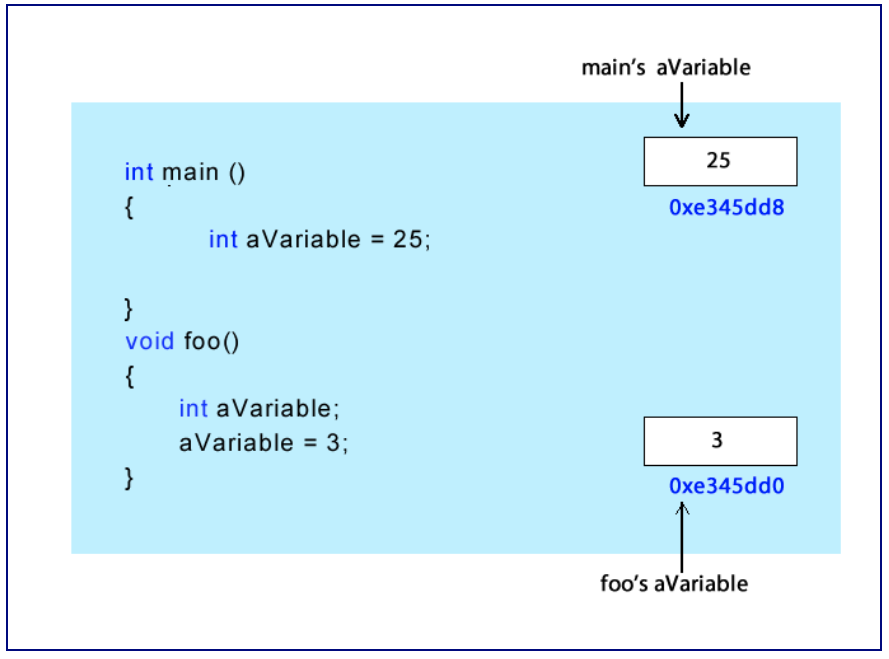

# Unit 10 - More Functions, Scope Rules

## Value Producing Functions



* Return Type - The type of data the function produces (int, char, float, double, bool, etc.)
* Function Name - Should be descriptive, like variables
* Formal Parameters - Additional information needed to perform the task. Called formal because it is formally stated; the type of data to work on goes in front of the variable name
* The function body is surounded by curly braces; all code needed to perform the task is inside



```cpp
#include <iostream> 

using namespace std; 

int getValue(); 

int main()
{
   int someValue; 

   someValue = getValue();
   cout << "The value entered was " << someValue << endl;

   return 0;
}
int getValue()
{
   int val;

   cout << "Please Enter an Integer " << endl;
   cin >> val;
   return val;

}
```

* The assignment of the function to a variable works, because the function returns an int type
  * It's the same as ```int x = 30;```
  * The value being produced from the function can be treated like any other variable

```cpp
#include <iostream> 

using namespace std; 

int getValue(); 

int main()
{
   cout << "The value entered was " << getValue(); <<  someValue << endl;

   return 0;
}
int getValue()
{
int val;

 cout << "Please Enter an Integer " << endl;
 cin >> val;
 return val;
}
```

### Passing Parameters

* Information passed to functions are called arguments or parameters
  * Can be classified into formal parameters and actual parameters

* Formal parameters are formal because they are formally stated; specify the data type the parameter will hold



* THe actual parameters are placed inside the parentheses when you invoke the method; you do not need to provide a data type
  * Place a variable, value, or expression inside hte parentheses



```cpp
#include <iostream>
#include <cmath> 

using namespace std; 

int squareOrCube(int x); //Function prototype  

int main()
{
int someValue; 

   cout << "Enter a value " << endl;
   cin >> someValue;
   someValue = squareOrCube(someValue);
   cout << "The value calculated is " << someValue << endl; 

   return 0;
}

int squareOrCube(int x)
{
    if(x > 5)
      return pow(x, 2.0);
    else
      return pow(x,3.0);
}
```

* The function takes in a formal parameter, an integer called x. It's like declaring an int variable inside the body of the function. It receives a copy of the value from where it is called
  * It is legal to pass a variable parameter in the function and assign what is returned back into that variable

### How Parameters are Passed

* Parameters in C++ are passed by value; a copy of what is in the variable that is the actual parameter is pushed onto the stack. The code branches to the function where the copied values are then popped off the stack and into the variables that are the formal parameters



```cpp
int addEmUp(double a, double b, int c); 

int main()
{
double x = 3.3;
double y = 2.1;
int z = 5;
int sum; 

    sum = addEmUp(x, y, z);	// These are the actual arguments
    cout << "The sum of the values is " << sum << endl;
   return 0;
}
int addEmUp(double a, double b, int c)	// These are the formal arguments
{
   return static_cast<int>(a) + static_cast<int>(b) + c;
}
```

### Coupling and Cohesion

* When writing functions, there are two things you should achieve
  * Your function should be loosely coupled
  * Your function should be hihgly cohesive

* Coupling refers to how tightly integrated your code is into your program. Ideally you want your code to be as portable as possible so that you can use it in other programs. If a function is too dependent on the program it was written in it can not easily be used else where

* Cohesion has to do with how many things your code does. Ideally you want your functions to do one thing and one thing only

```cpp
#include <iostream>
#include <cmath>

using namespace std;

void Square();
int main()
{
   Square();
   return 0;
}
void Square()
{
   int num;
   cout << "Enter a number " << endl;
   cin >> num;
   cout << num << " squared is " << num * num << endl;
}
```

* The code is not cohesive because the square function is doing multiple things at once, not only squaring but aslo getting the input and output
* The coupling is not good because the code is dependent on cin and cout to do the work, when not all programs will ask for an input and show output

```cpp
#include <iostream>
#include <cmath>

using namespace std;

void square(int x);
int main()
{
   int num;
   cout << "Enter a number " << endl;
   cin >> num;
   cout << num << " squared is " << square(num << endl;
   return 0;
}
void square(int x)
{
   return x * x;   
}
```

* Always ask yourself how many things does the function perform; if it is more than one you should maybe rethink things

## Scope Rules

* When you write functions, you should try to make them as portable as possible; be able to copy them from one program to another or put them in a library so they can be used in any future program
  * A self-contained unit, kind of like a separate program in a big program

* Local Variables - defined in the body of the function
  * The variable can only be accessed within that function

```cpp
#include <iostream>
#include <cmath>

using namespace std;

void foo();

int main()
{
   foo();
   avariable = 25; // Can't do this because main knows nothing of aVariable
   cout << aVariable;
   return 0;
}
void foo()
{
int aVariable; // aVariable is local to foo and can only be used in foo
   aVariable = 3;
   cout << aVariable << endl;
}
```

```cpp
#include <iostream>
#include <cmath>

using namespace std;

void foo();

int main()
{
int aVariable = 0;
   foo();
   avariable = 25; // aVariable is local to main
   cout << aVariable;
   return 0;
}
void foo()
{
int aVariable; // aVariable is local to foo and can only be used in foo
   aVariable = 3;
   cout << aVariable << endl;
}
```

* While these two variables have the same name, they are not the same. Each one sits in its own memory location
  * It's like two guys named Joe, same name different person



### Global Variables

```cpp
#include <iostream>
#include <cmath>

using namespace std;

void foo();

int aVariable; // Defined globally, outside of all functions


int main()
{
   foo();
   avariable = 25; 
   cout << aVariable;
   return 0;
}
void foo()
{
   aVariable = 3;
   cout << aVariable << endl;
}
```

* When foo() is invoked, the aVariable takes precedence over the global aVariable and cout prints 3

### Block Scope

```cpp
#include <iostream>
#include <cmath>

using namespace std;

int main()
{
int x = 20;

   {
      int x = 10;
      cout << x << endl;
   }
   {
      cout << x << endl;
   }

   return 0;
}
```

* A new instance of x is created inside the block; it is the same name but it is a new variable that can be only accessed in the block
  * The first block will print 10
  * The second block will print 20

```cpp
#include <iostream>
#include <cmath>

using namespace std;

int main()
{

   for(int i = 0; i < 100; i++)
   {
      cout << i * i << endl;
   }
   i = 20; //This is an error, i is outside the scope of loop 
   cout << i << endl;

   return 0;
}
```

* i can only be accessed from within the block in which it was declared

### The Stack and Heap

* When your program gets built, the compiler will set aside some memory called the stack
  * A data structure that is like a stack of plates with two functions, push and pop
  * Vales are pushed on to (added) and popped (removed) from the top of the stack
    * LIFO (Last In First Out) data structure
  * When a function is called and variables declared in the function, they are declared in the stack
  * Whenn a function returns, the variables for the function are popped off the stack
    * In a way, C++ memory is like an accordian, growing as more variables are declared and shrinks when discarded

* Avoid use of global variables
  * Impossible to have your functions be loosely coupled
  * When variables are global, they can be seen and modified by any function anywhere

