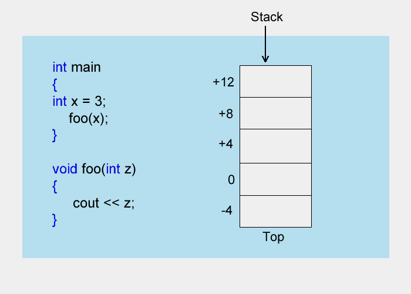
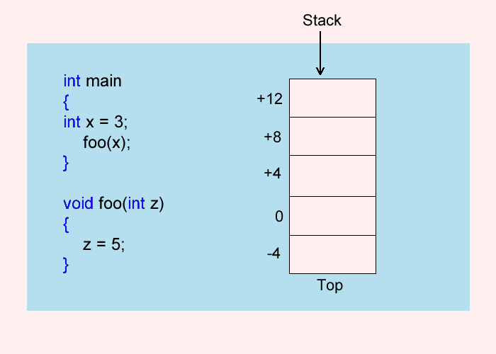

# Unit 11 - Function Overloading

## Pass by Value

* By default parameters in C++ are passed to function by value; you are actually passing a copy of the value

```cpp
#include <iostream>
#include <ctime>

using namespace std;

void foo(int z);

int main()
{
int x = 3;

   foo(x);   
   return 0;
}
void foo(int z) 
{
   cout << z << endl;
}   
```

* When foo is called, it takes a copy of the value that is contained within the variable x, which is 3
  * The local variable in foo is somewhat special in that it gets initialized with the copy of the value that was passed to it (3)

* The stack is a piece of memory that gets created when your program runs
  * Used to hold local variables and information that allow a function to return to where it came from
  * Two operations: Push and pop
    * Push put things on top of the stack
    * Pop is used to remove things from the top of the stack
  * LIFO - Last In First Out structure, efficient because it can contain no gaps; the next piece of information is always in the next memory location

* The CPU consists of several registers
  * ESP - Extended Stack Pointer, holds the address at the top of the stack
    * Used so that the data can be pushed and popped at the right location
  * EBP - Extended Base Pointer, used to hold a reference to the bottom of hte stack
  * EIP - Extended Instruction Pointer, holds the address of the next instruction to be executed

* When a function is called a few things need to happen
  * The function parameters are pushed on to the stack
  * The function return address is pushed onto the stack 
  * The frame pointer of the previous value of the EBP is pushed onto the stack
  * The address of the function is placed into the EIP and the code jumps to the function



* In order for the function to return back to where it came from, some of the information placed on the stack needs to be restored
  * The EBP needs to be copied, but to do so, the variable z has to get popped off the stack -> Gets destroyed
  * Then the return address needs to be popped into the EIP so that the code can branch back to where it came from

## Pass by Reference

* There are times where you may want a function to produce more than one value
  * To get around the limitation of one return value, you can pass values by reference
  * When you pass by reference, what is passed is the address of where the variable sits in memory
  * Put an & in front of the formal parameter




```cpp
#include <iostream>
#include <ctime>

using namespace std;

void swap(int &x, int & y);

int main()
{
int a = 2;
int b = 3;
   
   cout << "Before Swap " << a << " " << b << endl;
   swap(a, b);
   cout << "After Swap " << a << " " << b << endl;
  
   return 0;
}
void swap(int &x, int &y) 
{
int tmp;

   tmp = x;
   x = y;
   y = tmp;
   
}
```

* The values can be swapped and change outside the function because a copy of the addresses are passed, and not just values

### Downside

* Passing by reference can be on the confusing side
  * Hard to tell that a call to a function are passing by reference
  * You would have no idea that a function may actually modify your copy of the variables

## Default Parameters

* Default arguments allow you to set a value that will serve as a default value if you don't supply a parameter

```cpp
#include <iostream>

using namespace std;

// default argument in prototype only
int calcArea(int length, int width = 2);

int main()
{
int a1, a2;

   a1 = calcArea(2,5);
   a2 = calcArea(3);
   return 0;
}

int calcArea(int length, int width)
{
   return length * width);
}
```

* The default argument (width) is set to 2


* Always defined in the function prototype
* You have to make sure that the default arguments always appear last

## Function Overloading

* If you needed a function to pass 2 ints and a double, and the next time pass 2 ints only, before you would have to create a different function for each version that you needed
  * Overloaded functions can almost achieve this; still have to write the function bodies but all the functions have the same name

```cpp
#include <iostream>

using namespace std;

int addEm(int a, int b, int c);
int addEm(int a, int b);

int main()
{
int x,y,z;

   cout << "Enter 3 Integers " << endl;
   cin >> x >> y >> z;

   cout << "The sum of the first two is " << addEm(x, y) << endl;
   cout << "The sum of all three is " << addEm(x,y,z) << endl;

   return 0;
}
int addEm(int a, int b)
{
   return a + b;
}
int addEm(int a, int b, int c)
{
    return addEm(addEm(a,b),c);
}
```

* The compiler will sort out which function to call by matching arguments
* It is typical that one function is a simplified version of the other; call the function instead of duplicating code

### Automatic Type Conversion

* The compiler will try to match arguments in the best way it can
  * You have a function that takes two doubles, but you pass two ints, the compiler will convert the ints to doubles automatically

```cpp
#include <iostream>

using namespace std;

void swap(int &x, int &y);

int main()
{
int a = 2;
int b = 3;

   cout << "Before Swap " << a << " " << b << endl;
   swap(a, b);
   cout << "After Swap " << a << " " << b << endl;

   return 0;
}
void swap(double &x, double &y)
{
double tmp;

   tmp = x;
   x = y;
   y = tmp;
}
```

* Automatic Type Conversion Rules
  * Exact match
  * Matches using promotion within integer types or floating point types. Char to int and bool to int are considered promotions also
  * Matches using other conversions of predefined types, such as int to double
  * Matches using user defined types

```cpp
int main()
{
   foo(10, 20);
   
   return 0;
}
int foo(int a, double b)
{
}
int foo(double b, int a)
{
}
```

* Ambigious overloading is legal, but the compiler will get confused and not know which version of the function to be invoked

```cpp
int main()
{
int x;
double y;
   
   x = foo(3.3);
   y = foo(4.4);  

   return 0;
}

double foo(double x)
{
   return x + 1.1;
}
int foo(double x)
{
   return static_cast<int>(x) + 1;  
}
```

* Overloaded functions must differ in more than their return type

