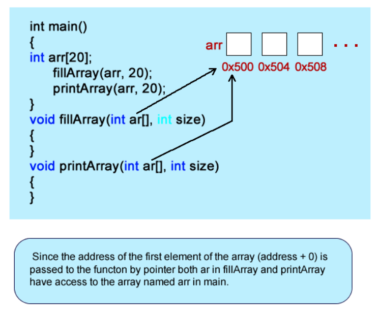

# Unit 13 - Arrays

## Arrays

* Primitives types are nothing more than the smallest data types that a langauge can have
* Arrays are the first look into abstract data types
  * Putting together primitives types to create a custom type; one that you definn

* An array is a contiguous group of homogeneous elements
  * Contiguous meaning they sit next to each other in memory, sequential fashion
  * Homogenuous meaning that they all of the same type
  * Think of it as a grocery list


* You declare an array like any other variable; type, name, then you place an open annd closed bracket with the number of elements that you wish to have
  * Declares an array of ints 5 elements long
  * You can add elements by using the assignment operator


* Brackets serve double duty
  * On declaration time, you put the number of elements that you want the array to hold
  * Any other time, you place the number of the element that you wish to address
  * myArray sub 1 is equal to 5


* Because an int is four bytes wide, the address above increase by four
  * If it was a char, the address increases by one because the char is one byte

* `myArray[2] = 6` is like saying take the base address 0x500 and add eight to it (two ints apart, so 2 * 4 bytes)and place the value 6 at that memory location
  * The memory locations are not accurate, they would be large hex numbers
  * The subscript of an array is really just an offset in memory from the base address

## Initializing Arrays at Declaration


* Arrays can be initialized to values at the time they are declared
* The number in the brackets is missing; there is no need to announce how many items you want, the compiler will figure it out for you by counting all of the values within the curly braces

```cpp
#include <iostream>

using namespace std;

int main()
{
double d[] = {3.44, 2.22, 1.22, 5.55, 1.89, 99.99};

   for(int i = 0; i < 6; i++)
      cout << d[i] << endl;

   return 0;
}
```

* Declaring an array 6 elements long
* The loop goes through and prints out the array
  * The i variable of the loop is not just for counting the loop but for the index of the array

```cpp
#include <iostream>
#include <ctime>

using namespace std;

int main()
{
srand(static_cast<int>(time(0));

int ar[20];

   for(int i = 0; i < 20; i++)
      ar[i] = rand() % 100 + 1;

   for(int i = 0; i < 20; i+=2)
      cout << ar[i] << "\t" << ar[i + 1] << endl;

   return 0;
}
```

* Fills an array with 20 random numbers in the range of 1-100 and prints it out in 10-row 2-column fashion

## Arrays as Arguments

* Arrays get passed to function by pointer (similar to a reference). It is really a copy of the base address (Address of element 0) of the array that gets passed


* The base address, first element address is 0x500. This is what gets passed to the function

```cpp
#include <iostream>
#include <ctime>

using namespace std;

void fillArray(int ar[], int size);
void pritnArray(int ar[], int size);

int main()
{
int myArray[20];

   fillArray(myArray,20);
   printArray(myArray,20);

   return 0;
}
void fillArray(int ar[], int size)
{
   srand(static_cast<unsigned int>(time(0)));

   //Fill the array!
   for(int i = 0; i < size; i++)
      ar[i] = rand() % 101;
}
void printArray(int ar[], int size)
{
   for(int i = 0; i < size; i++)
      cout << ar[i] << "\t" << ar[i + 1] << endl;
}
```

* An array of 20 integers is declared. It gets passed to the fill array function by reference (actually by pointer, to be covered later). Because the element of the first element is being passed, the parameter ar in the function fillArray references the base address of the array (arr) that was passed to it. It references the array in main
  * Notice that the formal parameter and the prototype use brackets, but the actual parameter doesn't; the name of the array is actually the base address



* Notice that a parameter is needed for the size of the array; arrays are primitive and do not have facility to determine size
  * Pass the size so that the function doesn't try to use an index that is beyond the end of the array

```cpp
#include <iostream>
#include <ctime>

using namespace std;

void fillArray(int ar[], int size);
void pritnArray(int ar[], int size);

int main()
{
int myArray[20];

   fillArray(myArray,21);
   printArray(myArray,21);

   return 0;
}
void fillArray(int ar[], int size)
{
   srand(static_cast<unsigned int>(time(0)));

   //Fill the array!
   for(int i = 0; i < size; i++)
      ar[i] = rand() % 101;
}
void printArray(int ar[], int size)
{
   for(int i = 0; i < size; i++)
      cout << ar[i] << "\t" << ar[i + 1] << endl;
}
```

* In the above code, the main function sends a size of 21 but the array will only hold 20. This can have strange errors
* You cannot return an array from a function

```cpp
int [] retArray()
{
   int ar[] = {1, 2, 3, 4, 5};

   return ar;
}
```

* This doesn't work because local variables are declared on the stack and get destroyed when the function returns
  * You can declare an array on the heap

## Read Only Arrays

* Passing arrays can be dangerous because the function they are passed to can always modify them
  * When arrays only need to be read, it shouldn't be given permission to modify it
  * The keyword const should be used

```cpp
#include <iostream>
#include <ctime>

using namespace std;

void fillArray(int ar[], int size);
void pritnArray(const int ar[], int size);

int main()
{
int myArray[20];

   fillArray(myArray,20);
   printArray(myArray,20);

   return 0;
}
void fillArray(int ar[], int size)
{
   srand(static_cast<unsigned int>(time(0)));

   //Fill the array!
   for(int i = 0; i < size; i++)
      ar[i] = rand() % 101;
}
void printArray(const int ar[], int size)
{
   for(int i = 0; i < size; i++)
      cout << ar[i] << "\t" << ar[i + 1] << endl;
}
```
