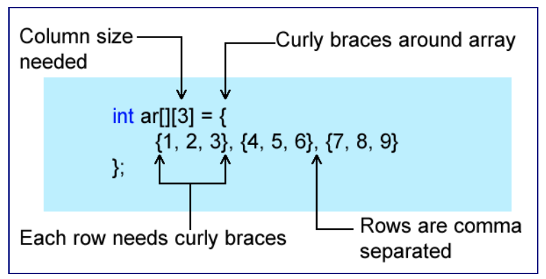

# Unit 14 - Multidimensional Arrays

## Multi-dimensional Arrays

* Arrays can come in any number of dimensions you like
  * If you have to go more than two dimensions, there may be a better way of doing things
  * Think of two dimensional arrays like a grid, a bingo card that consists of rows and columns


* You declare a two dimensional array the same way you would a one dimensional array except that you have to add another set of brackets
  * Think of the first number as the number of rows, the second number as the number of columns


* You should think of a two dimensional array beinng laid out in row / column fashion. In memory though, the elements are contiguous like this:


* From the row column value, the compiler will figure out mathematically where the offset in memory is from the base address

### Initializing 2D Arrays at Declaration



* When initializing a two dimensional array at decalaration time, you must follow these rules
  * You must supply the number of columns
  * The two dimensional array must be enclosed in curly braces
  * The closing curly brace surrounding the array must have a semicolon
  * Each row is surrounded by curly braces
  * Each value within the row must be comma separated
  * All rows are comma separated


```cpp
#include <iostream>
#include <ctime>

using namespace std;

int main()
{
int ar[5][5];

   srand(static_cast<unsigned int>(time(0)));
   for(int row = 0; row < 5; row++)
   {
      for(col = 0; col < 5; col++)
      {
         ar[row][col] = rand() % 101;
      }
   }

   for(int row = 0; row < 5; row++)
   {
      for(col = 0; col < 5; col++)
      {
         cout << ar[row][col] << "\t";
      }
      cout << endl;
   }
   return 0;
}
```

### Multidimensional Arrays as Arguments

* When you call the function you still just pass the array name, you are still passing the base memory address of the array
* You must specify a column size


* You need to put the column size because the compiler needs to know where each row ends
  * You should also pass the size of the row so that your code will know how to handle it

```cpp
#include <iostream>
#include <ctime>

using namespace std;

void fill2DArray(int ar[][5], int numRows);
void print2DArray(const int ar[][5], int numRows);

int main()
{
int ar[5][5];

   srand(static_cast<unsigned int>(time(0)));

   fill2DArray(ar, 5);
   print2DArray(ar, 5);
   return 0;
}
void fill2DArray(int ar[][5], int numRows)
{
   for(int row = 0; row < numRows; row++)
   {
      for(col = 0; col < 5; col++)
      {
         ar[row][col] = rand() % 101;
      }
   }
}
void print2DArray(const int ar[][5], int numRows)
{

   for(int row = 0; row < numRows; row++)
   {
      for(col = 0; col < 5; col++)
      {
         cout << ar[row][col] << "\t";
      }
      cout << endl;
   }
  
}
```

## CStrings

* C++ was born out of the C programming language
  * A very simple language; it has less keywords than any other high level programming language
  * C++ and C don't offer string as a primitive type
  * C++ initially did not have a string, but was introduced in the mid 1990s when the STL was adopted

* Because the C programming language did not have a string, you were forced to use an array of characters
  * CStrings are nothing more than an array of characters with a special marker added at the end
  * The marker is a binary 0 but most of the time you will see it written using the escape character '\0'

### Using Strings at Declaration


* When you initiliaze a string at declaration time, the compiler automatically adds the null character for you

### Declaring CStrings


* You declare a string the same way you would any other array but you have to make sure to leave room for the null character

### Arrays Cannot be Assigned to Each Other


* This is not legal because arrays are pointer types (discussed later)
  * It would be like trying to assign the address of the first element name to cpyName
    * The compiler would not allow this because it interprets that an address is being changed

* To copy addresses, you could use a loop and copy the array character (would be inefficient and require a lot of work)
  * C++ offers functions to help; you would use the strcpy_s function


### Passing CStrings to Functions

* Passing a string to a function is just like passing any other array to a function except you don't have to pass along the size 
  * C++ has a string function, strlen, that will return the number of characters in the string minus the null


```cpp
#include <iostream>
#include <ctime>

using namespace std;

int countVowels(char str[]);

int main()
{
   char str[] = "This is a test";
   cout << "There are " << countVowels(str) << " Vowels in: " << str << endl;
   return 0;
}
int countVowels(char str[])
{
int count = 0;

   for(int i = 0; i < strlen(str); i++)
   {
      switch(toupper(str[i]))
      {
         case 'A':
         case 'E':
         case 'I':
         case 'O':
         case 'U':
            count++;
      }
   }
   return count;
}
```

* The function takes vowel as an argument, a string called str
  * strlen function is used to determine how many characters there are to determine loop bounds 


### Commonly Used String Functions

* strcpy_s(str1, str2)
  * Copies str2 to str1

* strcpy_s(str1, size, str2)
  * Copies size number of characters from str2 to str1

* strlen(str)
  * Returns the number of characters in str

* strcat(str1, str2)
  * Concatenates (joins) str2 to str1

* strcmp(str1, str2)
  * Compares str1 to str2
    * If str1 == str2 return 0
    * If str1 < str2 return -1
    * If str1 > str2 return 1

## Vectors

* The vector is our first look at the standard template library (STL). The classes of STL are also called container classes because they contain lists of data
  * The vector acts like an array that will grow and shrink depending upon the amount of data put into it
  * You don't have to worry about the memory management that goes along with growing and shrinking arrays
  * You can think of a vector as a class that will hold any type of data and as much of it as needed


* To use a vector, include the vector header: #include <vector>
  * vector<Rectangle> rect;

## Like Arrays

* Vectors can be used like an array; you can use array notation to access elements
  * int x = v[0];

* You need to be careful about using this syntax when adding elements. If the vector does not have any size then you will get a bad error
  * Use the constructor to reserve space

```cpp
vector<int> v(100);
v[1] = 30;
```

* If you want to create space in a vector you have to use the resize function

```cpp
vector<int> v;
v.resize(25);
v[1] = 30;
```

* If you don't want to set an initial capacity, you can use the push_back function which creates space when there is none available

```cpp
vector<int>
v.push_back(32);
```

## Determine the size of the vector

* The vector class has a function called size() which returns the number of elements in the vector
  * An advantage over arrays; with arrays you're forced to pass around the size to each function that needs to manipulate it

```cpp
for (unsigned int i = 0; i < v.size(); i++)
	cout << v[i] << endl;
```

* The vector actually returns an unsigned int; there should never need to be a negative number of elements within it

### Vector Capacity

* When the vector gets full and you add another element, the capacity increases
  * Dependent on implementation but many times it would double its capacity each time it gets full
  * Size is the number of elements in the vector
  * Capacity is how much it will hold
    * Capacity will often be larger than size
  * Vectors are said to not be very efficient because of the way they handle memory
    * You can use the reserve function to specify how much more memory to allocate (instead of doubling it)

### Vector Useful Functions


### Iterators

* All STL container classes contain iterators that are used as a means of iterating across the entire collection
  * The iterator is really like a type safe pointer and as a matter of fact is used as one

* To create an iterator you use the scope resolution operator

```cpp
vector::iterator p;
```

* To set the iterator at a starting point we use some of the built in functions that are designed for iterators

```cpp
vector<int> v;
vector<int>::iterator p;

p = v.begin();
```

* You can also set it to the end

```cpp
p = v.end();
```

* These two functions are useful in for loops to iterate across the entre collection

```cpp
for (p = v.begin(); p < v.end(); p++)
```

* Notice that the iterator is used just like a pointer; if you wanted to output what the iterator is pointing at you would treat it as a pointer also

```cpp
cout << *p << endl;
```

### Fill a Vector with/without an iterator

```cpp
#include <iostream>
#include <vector>

using namespace std;

void fillVect(vector <int> &v);
void printVect(const vector <int> &v>;

int main()
{
   vector<int> v:
   fillVect(v);
   printVect(v);
   return 0;
}
void fillVect(vector <int> & v)
{
   srand(static_cast<unsigned int>(time(0)));
   for(int i = 0; i < 100; i++)
     v.push_back(rand() % 1001);
}
void printVect(const vector<int &v)
{
   for(int i = 0; i < 100; i++)
     cout << v[i] << endl;
}
```

```cpp
#include <iostream>
#include <vector>

using namespace std;

void fillVect(vector <int> &v);
void printVect(const vector <int> &v>;

int main()
{
   vector<int> v:
   fillVect(v);
   printVect(v);
   return 0;
}
void fillVect(vector <int> & v)
{
   vector<int>::iterator p;
   srand(static_cast<unsigned int>(time(0)));
   for(p = v.begin(); p < v.end(); p++)
     *p = rand() % 1001;
}
void printVect(const vector<int &v)
{
   vector<int>::iterator p;
   for(p = v.begin(); p < v.end(); p++)
     cout << *p << endl;
}
```

