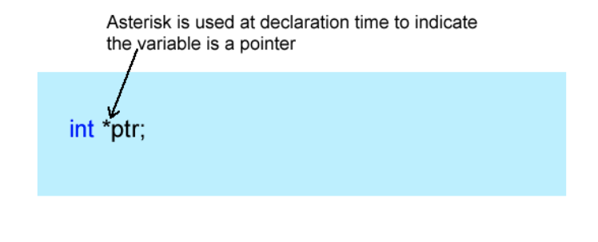
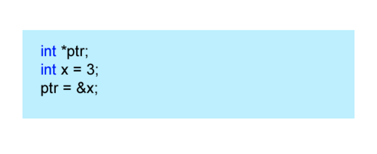
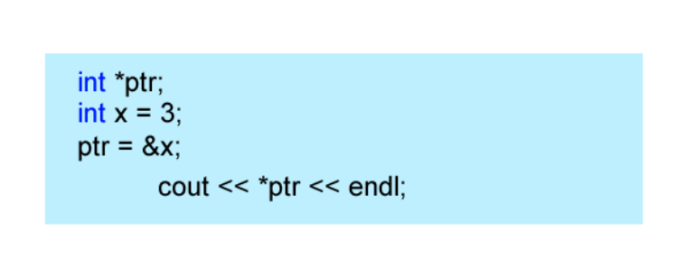
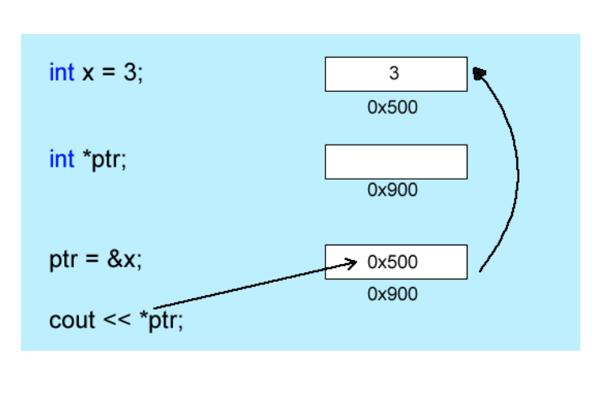
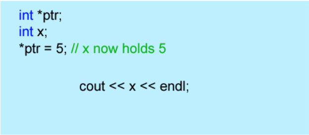
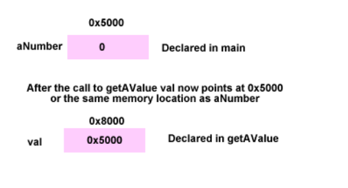

# Unit 15 - Pointers

## Pointer Basics

### What is a Pointer?

* A pointer is a special type of variable
  * Holds the address of another variable
  * Through the use of pointers, we can indirectly manipulate values at another memory location

* There are two symbols that you should know
  * `&` - addressof operator (same symbol used for references)
  * `*` - de-reference operator (it may be easier to think of it as the contents of the operator)

* The & symbol will get you the memory location of where a variable is stored

```cpp
#include <iostream>

using namespace std;

int main()
{
int x = 3;
   
   cout << &x << endl;
   return 0;
}
```

* Output: 0012FED4
* An integer varaible called x is declared and initialized with the value of 3. The cout function simply prints the memory address of where x is located in memory. This is done by preceding the variable with the addressof operator 8. 

### Declaring a Pointer

* You declare a pointer using the * dereference operator
  * You use this in two places
  * When you want to declare a pointer
  * When you want to get the value the pointer is referring to (pointing at)



* It does not hold the address of anything since it has not been initalized
* It does hold the value of a memory location - whatever the compiler picked



* Now ptr holds the address off x and can print or change the value of x indirectly using the pointer



* The above says take the memory location that the ptr holds (address of x) and get the value that is located there
  * Done with the asterisk *. Prints out 3

### Still Confused?

* A pointer is just like any other variable
  * The difference is that it holds the address of another variable



* Variable x sits at address 0x500 and that the pointer sits at 0x900
  * Assignment says take thea address of variable x and store it at the location of the pointter ptr

```cpp
#include <iostream>

using namespace std;

int main()
{
int x = 3;
int *ptr = &x;
   
   cout << ptr << endl;
   cout << &x << endl;
   cout << &ptr << endl;

   return 0;
}
```

* cout << ptr;   would print 0x500 because this is the address stored in the pointer variable.
* cout << *ptr; would print out 3 because this is what the pointer is referring to (what is stored in x).
* cout << &ptr; woud print out 0x900 because this is the address where the pointer sits in memory.

```cpp
#include <iostream>

using namespace std;

int main()
{
int ar[] = {2,3,5,6,2,7,9,0,10,12,15};
int *ptr;

  ptr = ar;

  for(int i = 0; i < 12; i++)
      cout << *ptr++ << endl; 
  

   return 0;
}
```

* Would print 5, 6, 2, 7, 9, 0, 8, 10, 12, 15
* The pointer is set to the address of the 3rd element of the array (ar[2]) the loop will proceed to print out the array but this time it starts at the third value of the array

### Pointers and Strings

* Before the STL string class, the C language created string variables that were just an array of the char variable type.

```cpp
#include <iostream>

using namespace std;

int countVowels(char str[]);

int main()
{
   char str[] = "This is a test" << endl;
   cout << "There are  " << countVowels(str) << " vowels in " << str << endl;

   return 0;
}
int countVowels(char str[])
{
   int count = 0;
   char *p;

   p = str; // Set p equal to the beginning of the string
   while(*p)
   {
      switch(*p)
      {
         case 'A':
         case 'E':
         case 'I':
         case 'O':
         case 'U':
            count++;
      }
   }
   return count;
}
```

* In the function countVowels, a char pointer is created and set to the beginning of the string. The while loop will continue while the pointer is pointing at anything other than 0
  * `while (*p)` means the same thing as `while(*p != 0)
    * Remember that the statement in the parentheses is being evaluated for truth; computers evaluate false as 0
  * In the switch statement, the character that the pointer is pointing at gets converted to upper case and sent into the switch statement

* An array is a pointer
  * The difference between [] and * is practically nothing

```cpp
#include <iostream>

using namespace std;

int countVowels(char str[]);

int main()
{
   char str[] = "This is a test" << endl;
   cout << "There are  " << countVowels(str) << " vowels in " << str << endl;

   return 0;
}
int countVowels(char str[])
{
   int count = 0;
   char *p;

   p = str; // Set p equal to the beginning of the string
   while(*p)
   {
      switch(toupper(*p++))
      {
         case 'A':
         case 'E':
         case 'I':
         case 'O':
         case 'U':
            count++;
      }
   }
   return count;
}
```

### Storing Values



* Can also be used to store values in a memory location

### Final Thoughts

* Pointers were around long before references were used
  * Pointers are considered dangerous because any memory location could be modified when pointed to
  * Most Windows machines have their memory protected
  * On embedded systems where there are no restrictions, pointers come in handy

* With references, you don't necessarily know the values that are being passed by reference
  * Pointers get around this as you almost always have to pass the address of something

## Pointers as Arguments

### Passing Arguments to Functions by Pointer

* Just as you can pass parameters by reference, you can pass parameters by pointer

```cpp
void getAValue(int *val)
{
   cout << "Enter a value " << endl;
   cin >> *val;
}
```

* Notice how the formal parameter takes a pointer to an int variable
  * When a value is taken from the keyboard, the dereference operator is used
  * Remember that this is a pointer and a pointer is a variable that holds the address of another variable

```cpp
int main()
{
   int aNumber = 0;
   
   getAValue(&aNumber);
   cout << "The number retrieved is " << aNumber << endl;
   return 0;
}
```

* The & is used to pass the address of the variable aNumber to the function
  * The function expects a pointer as a parameter
  * By passing the address, the pointer variable in the formal parameter of getAValue can now reference the memory location of aNumber declared in main



* By using the * dereference operator you are really referring to another variable's location in memory
  * Whenn you store something at *val you are really putting the value in aNumber
  * You are accessing the memory location of aNumber using the pointer *val

### Passing Arrays by Pointer

* Passing an array to a function is nothing more than passing a pointer

```cpp
void fillArray(int *ar, int size)
{

   for(int i= 0; i < size; i++)
      ar[i] = rand() % 101;

}
```

* The only thing new here is that we pass it by pointer instead of using the empty array brackets
* What you could say is that by passing the name of the array, it is passing the address of the first element
* You could also do fillArray(&anArray[0], size);


```cpp
void fillArray(int *ar, int size)
{

   for(int i = 0; i < size; i++, ar++)
      *ar = rand() % 101;

}
```

* When you increase the formal parameter you are somewhat losing the reference to the beginning of the array
  * To access the first element again you need to decerement the pointer
  * Simple solution is to set the pointer equal to the beginning of the array and increment it

### Using const with Pointers

* When used as a prefix to formal parameters, the const keyword makes a variable read only
  * Arrays are passed by pointer; if your information in the array doesn't need to be modified, it should be a const

```cpp
void printArray(const int *ar, int size)
{

   for(int i = 0; i < size; i++)
      cout << ar[i] << endl;

}
```

### The sizeof operator

* Return the size of a data type as its number of bytes
  * Used with an array, can determine how many bytes the array is
  * You can then divide the by the data type to get the number of elements in the array

```cpp
int main()
{
int ar[5];

   cout << "There are " << sizeof(ar) / sizeof(int) << "Elements in the array" << endl;

   return 0;
}
```
