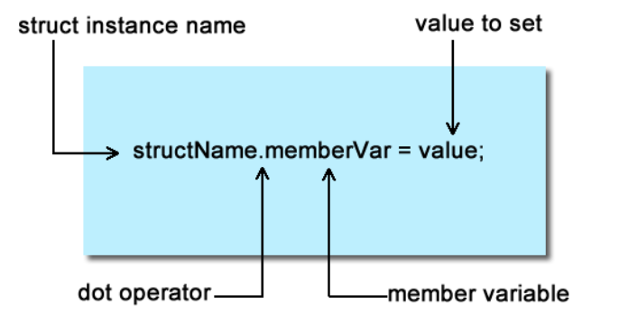

# Unit 16 - Structures & Classes

## Structures

* A structure is an abstract data type that you the programmer define
  * You can mix any primitive types (int, char, double) and combine them to create a struct
  * Unlike arrays, members of structures are not homogeneous
    * You can mix as many types as you need


* Remember to leave the semicolon at the end of the curly brace
  
* The struct above is nothing more than a definition
  * It occupies no space in memory
  * It is used by the compiler to calculate the amount of space needed in memory when you create an instance of it


### Accessing Data

* You can add data to an instance of your structure by using the dot operator



* To access a member of your structure, you put the structure instance name, followed by a dot and the member name you wish to access


```cpp
#include <iostream>
#include <ctime>

using namespace std;

struct Time
{
int hour;
int minute;
int second;
};
int main()
{
Time t;
int hour;

   cout << "Enter hour, minute, second" << endl;
   cin >> t.hour >> t.minute >> t.second;
   hour = t.hour;

   if(hour > 12)
      hour-=12; //Convert military hour to standard time
   cout << "The time you entered is " << hour << ":" << t.minute << ":" << t.second << endl;

   return 0;
}
```

* Creates a defintion of a structure called TIME, then an instance of it called t
  * The structure is filled out with the hour, minute, second from the user
  * The member variable of the TIME structure called hour is assigned to an int variable called hour
    * The hour is checked for military, then converted into standard time

### Initializing at Declaration


```cpp
#include <iostream>
#include <ctime>

using namespace std;

struct Time
{
int hour;
int minute;
int second;
};
int main()
{
Time t = {12, 20, 22};
    
   cout << "The time is " << hour << ":" << t.minute << ":" << t.second << endl;

   return 0;
}
```

### Structs and Arrays


### Initialization at Declaration


* Prints the above array

```cpp
#include <iostream>
#include <ctime>

using namespace std;

void printStruct(Time *tm);
void fillStruct(Time *tm);

int main()
{
   Time t;
   fillStruct(&t);
   printStruct(&t);

   return 0;
}
void fillStruct(Time *tm)
{
   for(int i = 0; i < size; i++)
   {
      tm->hour = rand() % 13;
      tm->minute = rand() % 13;
      tm->second = rand() % 61;
   }
}
void printStruct(Time *tm)
{
   for(int i = 0; i < size; i++)
   {
      cout << "The time is " << tm->hour << ":" << tm->minute << ":" << tm->second << endl;
   }
}
```

### Passing Arrays of Structures to Functions

* You pass arrays to functions the same you woudl any other type of array

```cpp
#include <iostream>
#include <ctime>

using namespace std;

void printArray(Time time[], int size);
void fillArray(Time time[], int size);

int main()
{
   Time t[3];
   fillArray(t, 3);
   printArray(t, 3);

   return 0;
}
void fillArray(Time time[], int size)
{
   for(int i = 0; i < size; i++)
   {
      time[i].hour = rand() % 13;
      time[i].minute = rand() % 13;
      time[i].second = rand() % 61;
   }
}
void printArray(Time time[], int size)
{
   for(int i = 0; i < size; i++)
   {
      cout << "The time is " << time[i].hour << ":" << time[i].minute << ":" << time[i].second << endl;
   }
}
```

* The notation for accessing members of a structure is slightly different when you are using a pointer to a structure
  * Use the arrow operator


```cpp
#include <iostream>
#include <ctime>

using namespace std;

void printStruct(Time *tm);
void fillStruct(Time *tm);

int main()
{
   Time t;
   fillStruct(&t);
   printStruct(&t);

   return 0;
}
void fillStruct(Time *tm)
{
   for(int i = 0; i < size; i++)
   {
      tm->hour = rand() % 13;
      tm->minute = rand() % 13;
      tm->second = rand() % 61;
   }
}
void printStruct(Time *tm)
{
   for(int i = 0; i < size; i++)
   {
      cout << "The time is " << tm->hour << ":" << tm->minute << ":" << tm->second << endl;
   }
}
```

* Use it when you want to access members of a pointer to a structure
* Notice that the structure in main was not declared as a pointer
  * It gets resolved in the argument by passing the address of the structure t (&t)
  * Since the functions are using pointers to structures that the arrow operator is used to access each member of the structure

## Header Files

* In the days before C++, C programmmers were very familiar with the use of header files
  * You would include a header file like this: `#include <stdio.h>`

* Every definition you create should go into a header file
  * You will then include that header file in your cpp file
  * The reason that you want to use header files is so you can include it in any file that is part of your project

```cpp
// Person.h

struct Person
{
string fName;
string lName;
string address;
};
```

```cpp
// Main.cpp 
#include <iostream>
#include "person.h"

int main()
{
Person p;

   return 0;
}
```

* Notice that main.cpp uses the preprocessor directive #include to include the header file
  * When the compiler opens main.cpp in will go through person.h and make note of the definitions that are defined within it
  * It's like taking the contents of person.h and prepending it to the beginning of main.cpp

* Header files that are a part of C++ use the <> in the include statement
  * Header files that you create and add as a part of your project use ""

`#include <stdlib.h>`
`#include "myHeader.h"`

* You can also include the path within the double quotes (avoid absolute paths and use relative instead)

`#include "c:\\myheaders\\myHeader.h"`

### Including Definitions Once

* When programs start getting big it may become difficult to figure out if a header file has been added to a .cpp file or not
  * Someone may create a file called includes.h which contains all of the headers being used in a project

```cpp
#include <iostream>
#include <cmath>
#include <cstdlib>
#include "person.h"
```

* Then in a .cpp file they simply

`#include "includes.h"`

* Someone new might come along and not realize that includes.h is there and they do this:

`#include "includes.h"`
`#include "person.h"`

* There is a mechanism that prevents duplication of definitiions

`#ifndef somelabel`
`#define somelabel`

`#endif`

* The typical thing is to give the name of the file in caps

* When the file is opened, the preprocessor checks to see if somelabel is not defined
  * If it is not, it is defined by the preprocessor
  * If later the file is opened a second time from the same .cpp file everything within the ifndef will not execute becasue some label was already defined by the previous opening of the file

```cpp
#ifndef PERSON
#define PERSON

#include <iostream>
#include <cmath>
#include <cstdlib>
#include "person.h"

#endif
```

## Classes

* Classes are data centric
  * They have a data section and a set of functions that operate on that data


* Classes look a lot like structures
  * C++ is really C with classes
  * A class is nothing more than a struct that allows you to put functions within it (a simplistic statement, but accurate)

### Encapsulation

* Means bringing everything together
  * In OOP we are bringing together data and functions that operate on data and bundling them into a class
  * Encapsulation allows you to hide the details of how the class was implemented
    * This allows programmers that are using your code to use it without worrying about the details of it
      * You don't need to know the details of how your car works to drive it

### Public and Private


* You can switch which sections of the class are private/public using their keywords

* Private means nothing outside the class can access it
  * These consists of variables but also utility functions
    * Utility functions are used by other functions in the class

```cpp
// Rectangle.h

#ifndef RECTANGLE
#define RECTANGLE

class Rectangle
{
private:
   int length, width;

public:
   void setValue(int len, int wid);
   int area();

};

#endif
```

* The code above is the header file for the Rectangle class
  * It contains a definitions of how a rectangle should behave

```cpp
// Rectangle.cpp
#include <iostream>
#include "Rectangle.h"

void Rectangle::setValues(int len, int wid)
{

   length = len;
   width = wid;

}

int Rectangle::area()
{

   return length * width;

}
```

### Prototypes

* You need to prototype functions like any, but you need to put them as part of the class
  * You tell the compiler what class the function belongs to

### Scope Resolution Operator

* Notice the function header for the function area

`int Rectangle::area()`

* To tell the compiler what class the function belongs to, the scope resolution operator is used

`::`

* It tells the compiler the function area is a member of the Rectangle class
* Your code would not compile without it because you have not created the functions that are defined in the Rectangle class

### Classes to Objects

* Classes are blueprints to objects
  * A class does not really occupy any memory
  * A class is also a definition for a type and gets created just like any other variable
  * To turn a class into an object, you must create an instance of it

`int x, y, z;`

* Rectangles can be created in the exact same way

`Rectangle x, y, z;`

```cpp
#include <iostream>
#include "Rectangle.h"

using namespace std;

int main()
{
Rectangle r1, r2;

   cout << "Enter a length and a width for the first rectangle" << endl;
   int l,w;
   cin >> l >> w;
   r1.setValue(l,w);
   cout << "The area of the first rectangle is" << r1.area() << endl;
   
   cout << "Enter a length and a width for the second rectangle" << Endl;
   cin >> l >> w;
   r2.setValues(l,w);
   cout << "The area of the second rectangle is " << r2.area() << endl;

   return 0;
}
```

### Variables

* The private section should have functions that are used to access it
  * In this way the programmer controls how the data gets set

* In a time class, if the variables had direct access, someone could change the hour, minute, second to whatever they want
  * It would seem logical that if the seconds were set to 61, that the seconds would change to 1 and the minute set to 1 also
    * But it would be hard to do without a function to handle

* Good object oriented programming practices is to provide public functions to private data
  * Accessor - is a function that accesses or returns data from the private section
  * Mutator - is a function that modifies the data in the private section

* An accessor is meant to simply return data in one form or another
  * It should not modify, so it is appropriate to make accessors constant

```cpp
int Rectangle::area() const
{
   return length * width;
}
```

* Don't forget that this declaration must also go with the prototype inside the header file

```cpp
class Rectangle
{
private:
   int length, width;

public:
   Rectangle(); //constructor
   int area() const;
   void setValues(int len, int wid);
};
```

* Functions and methods are used interchangeably
  * The term function stuck in C++, but some people persist calling it methods