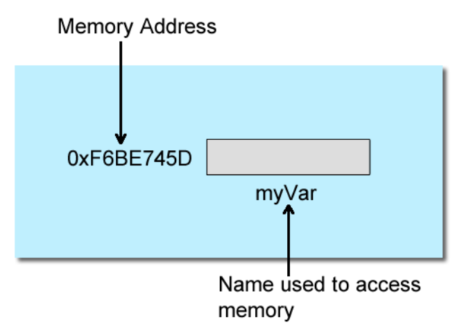
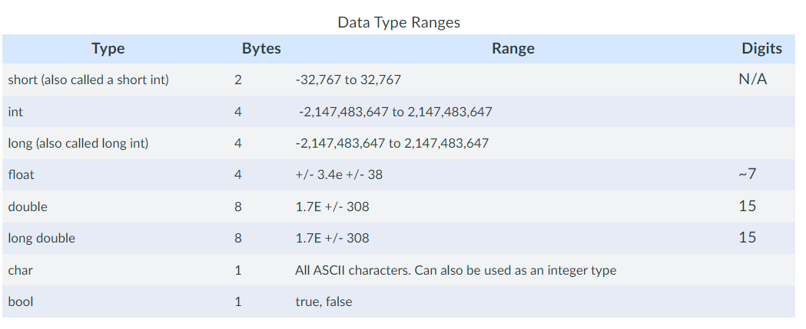
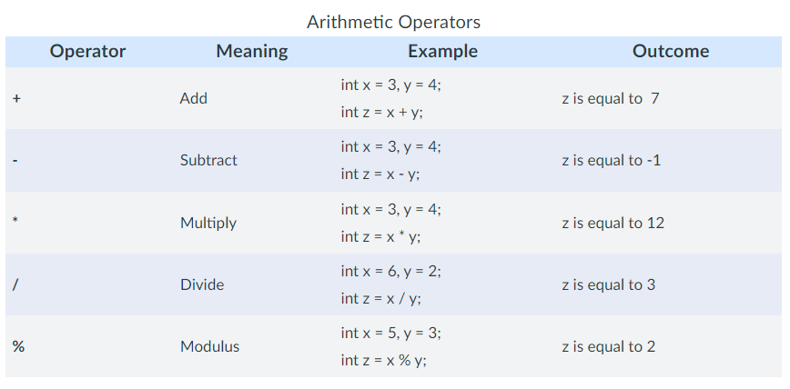
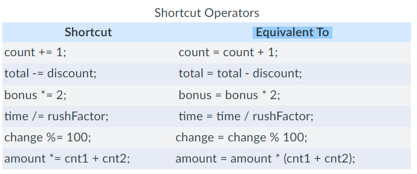
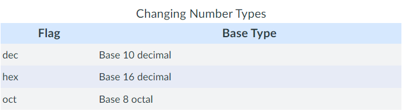

# Unit 2 - Data Types

## Variables

* A place in memory that will temporarily store data
* Memory address is a hexidecimal number
  * High level languages, don't need to worry about memory address



```cpp
int myVar;
```

* Creates a variable that will hold an integer value, name is myVar
* Compiler will find a chunk of memory and assign name to it



```cpp
char myChar;
int myInt;
long myLong;
float myFloat;
double myDouble;
```

* When you create a variable, an instance of the variable is created

## Storing and Retrieving Data

```cpp
int myInt;
myInt = 30;
```

* Use ```=```, assignment operator

```cpp
int myInt = 30;
```

```cpp
int x = 25;
int y;
y = x;
```

## Signed Numbers and Overflow

```cpp
int val = 214783468;
cout << val;
```

* Variable will overflow; negative number outputs to screen
  * Most Significant Bit (MSB) turns to 1 when the positive number becomes too large
* A signed number is a number that can run both positive and negative

```cpp
unsigned int val = 2147483648;
cout << val;
```

* Essentially given the variable the ability to hold twice as much in the positive direction

## LValues

* Something to the left of the equal sign
* Must always be a variable

```cpp
int x = 30;
25 = x;     // cannot assign variable to a literal
```

```cpp
int x,y,z;
x = y = z = 40;
```

* Above code declares x,y,z as int variables and assigns 40 to all three variables

## Variable Naming Rules

* Begin with a letter, underscore, or dollar sign
* After initial letter, names may also contain letters and digits. No spaces or special characters
* Can be of any length but try to be concise
* Cannot use C++ keyword for a variable name (ex. int)

```cpp
int my_int_varaible;  
int MyIntVariable;
int myIntVariable;
```

* Conventions have evovled through the years. Depends on the company. Be consistent
* Using x,y,z are just examples. Always make meaningful variable names

## Storing Literals

```cpp
long myLong = 23L;
```

* C++ always considers whole number values less than a long to be integers. To change it to long, append an L to the value

```cpp
float myFloat = 3.3F;
```

* C++ percieves that an attempt is being made to store a double in a float variable
  * Double is 8-byte data, float is 4-byte data
* To channge it to float, append an F to the value

```cpp
double d = 33.456;
int x;
x = d;
```

* Copying values from one data type to another can force a loss of data
* Cannot put larger buckets into smaller buckets, but can do smaller buckets to larger buckets
  * double to int is not okay, but int to double is

## Constants

* A variable that does not change; think of it as a read-only variable

```cpp
const double PI = 3.14159265;
```

* Pi is a good example, a number that does not change
* By convention, they should be capitalized

## Arithmetic Operators



* Modulus returns the remainder of a divison operation

### Integer Division

```cpp
int x = 7, y = 3;
int z = x / y;
int remainder = x % y
```

* z will get truncated, cannot hold the decimal place that 7 / 3 will resolve to
* Can use the modulus operator to get the remainder as an int

```cpp
int x = 145789;
int y = x % 10; // y = 9
```

* Modulus 10 can get the first digit of a number

## Type Casting

```cpp
int x = 0;
double z = 33.345;
x = (int) z;
```

* Temporarily make z an int and assign int portion to x

```cpp
int x = 0;
double z = 33.345;
x = static_cast<int>(z);
```

* C++ way, using code from standard template library

## Unary Operators

* Unary operators operate on one single operand

```cpp
int x = 0;
x++;        // x becomes 1
x--;        // x becomes 0
```

* Increment and decrement operators
  * Pre and post incerement and decrement

```cpp
int x = 2;
int y = 0;
y = 1 * x++;
```

* y equals 2, as the increment happens after the y assignment

```cpp
int x = 2;
int y = 0;
y = 1 * ++x;
```

* Pre-increment allows x to increment before assignment to y, y equals 3

## Shortcut Notation



## Input Output

### Input

* Programs consist of Input, Process, Output
* Input typically involves using cout to ask for input, cin to get that input
* Input is processed, spits output

## Stream Extraction Operator >>

* Used alongside cin/cout
  * Point in the direction you want the data to go

```cpp
#include <iostream>
#include <string>

using namespace std;

int main()
{
   int age;
   string name;
   char initial;

   cout << "Enter your name, middle initial, and your age " << endl; 
   cin >> name >> initial >> age;

   cout << "Hello " << name << ", " << initial <<" "
       << age << " is a great age" << endl;

   return 0;
}
```

* You can chain stream extraction operators

* cin is terminated when a white space is encountered

## Changing Base Types



```cpp
cout << hex << 16 << endl;  // 10 in decimal
cout << oct << 9 << endl;   // 10 in decimal
```

## Strings

* There is no type built into C++ to hold text
* To hold text in C would be to hold an array of characters
* String type was added to C++, a complex type that have functionality built into them

```cpp
#include <string>

using namespace std;

string str;

str = "Hello World";

string myString = "Hello World";

std::string s = "Hello World";
```

## Concatenating Strings

* Concatenation means adding one thing to the end of another

```cpp
string first = "Jacob";
string last = "Marinas";

string fullName = first + last";  // fullName = "Jacob Marinas"
```

## String Class Member Functions

* Initialization (Constructor)
  * May be defined without an initializating value
  * String expression ```string str2 = str1```
  * Character string literal ```string str4 = "Hello there"```
  * A single character ```string str7(1, 'A')``` Has desired length and a character to fill the string with

* String.at(index)
  * Returns the character within a string located at index

* String.length() / String.size()
  * Returns the length (number of characters) of the string

* String.c_str()
  * Sometimes necessary to convert a string object into a character array

* String.insert(size_type pos, const string str)
  * Inserts a string into the current string, starting at pos

* String.erase(size_type pos, size_type n)
  * Deletes substring from string

* String.replace(size_type pos, size_type n, const string str)
  * Same as erase but replaces with new string

* String.find(const string str, size_type pos)
  * Search for the first occurance of the substring str in current string

* String.rfind(const string str, size_type pos)
  * Same as find but returns the position of the first character if foudn

* String.substr(size_type pos, size_type n)
  * Returns substring of the current string