# Unit 3

### Bool

* Holds ```true``` or ```false```

```cpp
bool empty = true;
bool visible;
```

* Try naming variables so that when the value is true, your condition expressions can be phrased "naturally"

```cpp
if (finished)
if (visible)
```

### Relational Operators

* Boolean expressions uses
  * One of the relational operators
  * Two primitive type operands
  * To form a conditional statement that yields a Boolean (true/false)

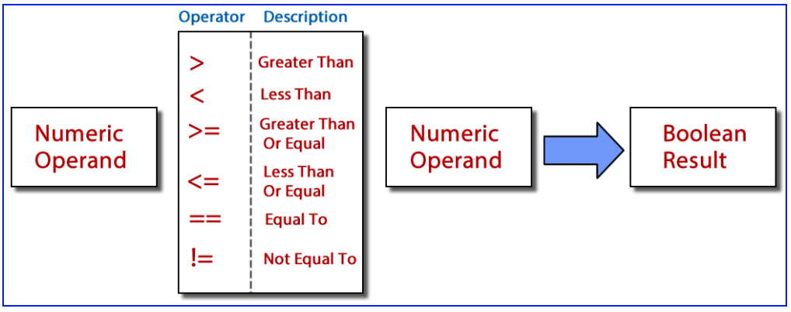

* ```==``` is equality, ```=``` is assignment
* ```!=``` for inequality, not ```<>```
* ```>=```, not ```=>```

### Primitive Relations

* You can only use comparable primitive types to form boolean expressions
  * Mixing primitive types is typically okay in C++

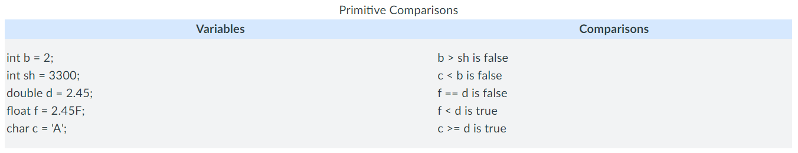

### Floating Point Relations

* Columns are in the reciprocal of powers of 2
  * 1/2, 1/4, 1/8, 1/16, 1/32, 1/64, 1/128

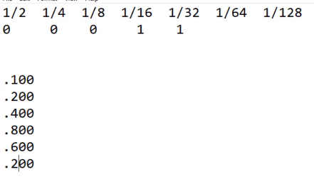

* Floating point numbers are approximations and should never be compared using relational operators
  * ```2.45``` and ```2.45F``` may look the same, but one is a double, the other is a float. They are represented differently in bits
  * ```.1``` bit pattern repeats to infinity, or at least to the size of the data type

### Binary

* Columns are in powers of 2
  * 128, 64, 32, 16, 8, 4, 2, 1

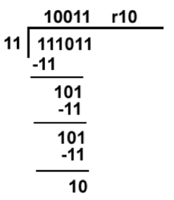

* 8 bits make a byte
  * Bytes can be broken into nibbles, 4 bits. Useful concept when computing hexedecimal

### Hexadecimal

* Columns are in powers of 16
  * 65536, 4096, 256, 16, 1

* A = 10, B = 11, C = 12, D = 13, E = 14, F = 15

* Hexadecimal is useful for condensing binary values into something more manageable

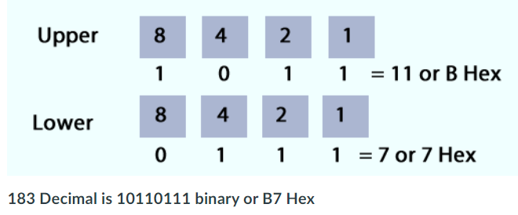

### Selection

* Performing decisions in code, to make your code branch in one direction or another
  * If, If-else, nested If-else, Switch, Conditional Operator [?:]

## The if statement

### Syntax

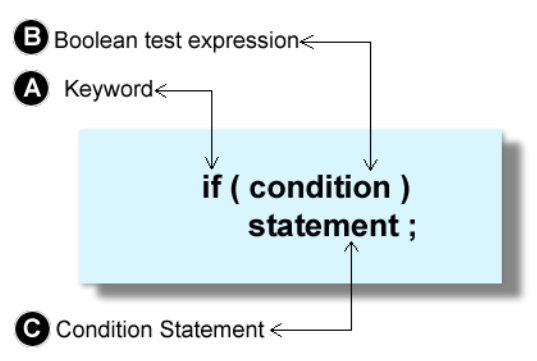

* Consists of
  * Header ```if (boolean expression)```
  * Body ```{}```
    * Can be omitted if single line

### Using if-else


### Indentation, Style, Pitfalls

* Should indent the code within the body of the block

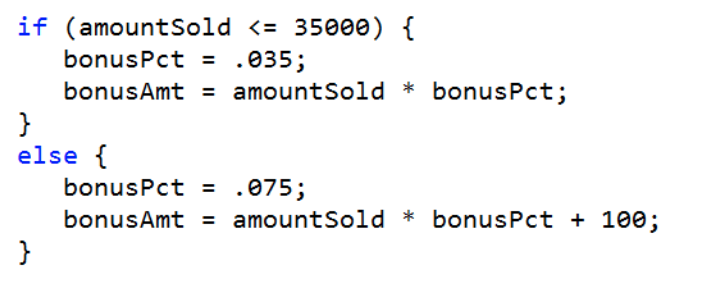

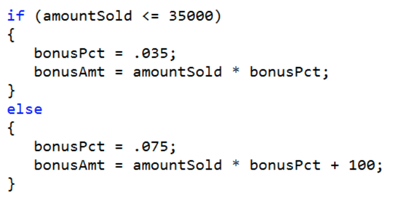

* Java style makes the source code smaller, but finding a missing brace can be harder to find
* C++ style takes up more space but aligns braces, easier to spot braces

### Why use braces

* Omitting braces can shorten the amount of source code, but it is still a good idea to use braces for maintainability

```cpp
if (amountSold <= 35000)
 bonusPct = .035;
else
 bonusPct = .075;
 bonusAmt += 100;

bonusAmt = amountSold * bonusPct + 100;
```

* The lack of curly brace will always perform the bonusAmt adding statement regardless of the if statement; to save headaches, use curly braces

### The Phantom Semicolon

```cpp
int employeesInBuilding = 0;

if (employeesInBuilding == 0); 
{
 demolishBuilding();
}
```

* The use of semicolon terminates the if statement and the body of the code will always execute
* If statements are blocks of code, so they use curly braces
* Statements are terminated with a semicolon

### Conditional Operator (Ternary Operator)

* A shortcut for an if-else statement
* Can produce a value

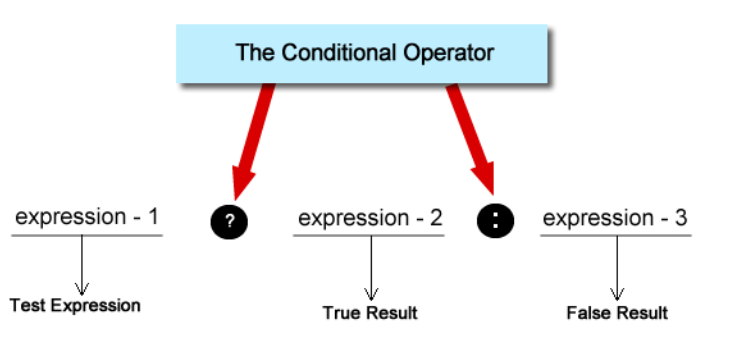

```cpp
bonusAmt = amountSold <= 35000 ? amountSold * .035 : 100 + amountSold * .075;
```

## Logical Operators

* Allows to make compound if statements

* C++ has three logical operators
  * Unary logical operator: NOT ```!```
  * Logical operator AND ```&&```
  * Logical operator OR ```||```

### NOT Operator

* Has the effect of flipping the value
* Takes one boolean operand/expression

```cpp
bool on = true;
bool off = !on;
```

* If the value is NOT true, then it is false

### AND/OR Operator

* Takes two boolean operands/expressions

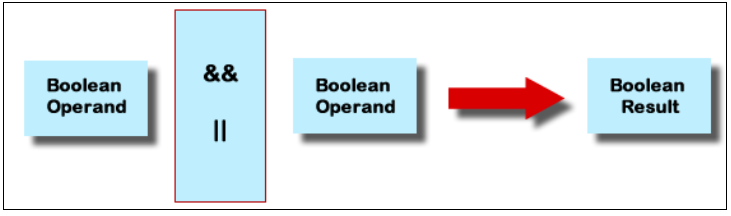

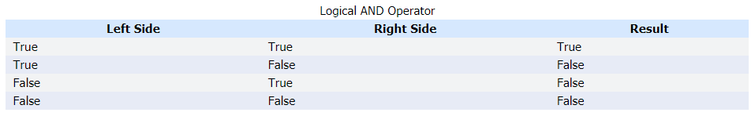

```cpp
if (finalScore > 90.0 && allAssignmentsComplete == true) 
{
    classGrade = 'A';
}
```

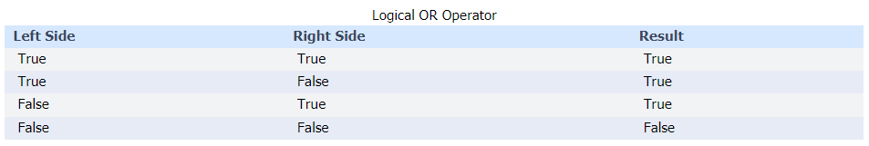

```cpp
if (finalScore > 90.0 || allAssignmentsComplete == true) 
{
    classGrade = 'A';
}
```

* Be weary of impossible conditions; cannot be both under 13 and over 55 at the same time

```cpp
if (age <= 13 && age >= 55) 
{
    discount = .18;
}
else
{
    discount = 0.0;
}
```

* Unavoidable conditions; will always evaluate to true or false for any value

```cpp
if(age > 15 || age < 55)
{
   admission = 10.0;
}
else
{
   admission = 8.75;
}
```

### Operator Precendence

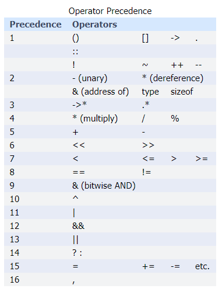

* Note that AND has higher precedence than OR

```cpp
10 < 15 || 5 > 8 && 3 > 5; // evaluated as 10 < 15 || (5 > 8 && 3 > 5) which is true
```

