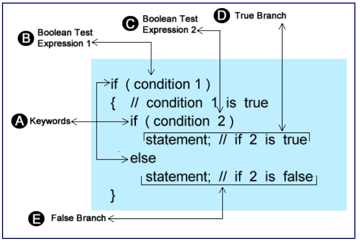
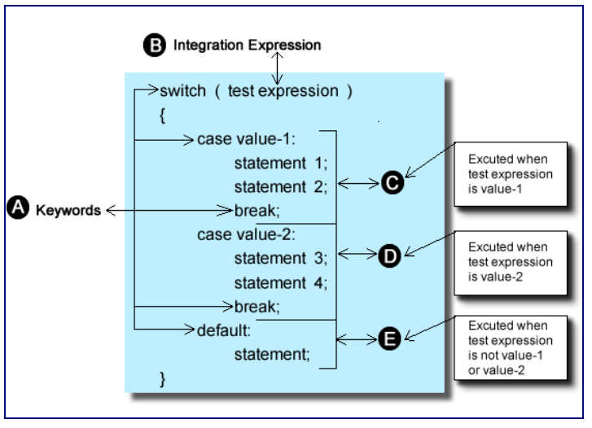

# Unit 4 - Multi-way Branching

## Multi-way Branching

* There are many ways to accomplish the same task; logical operators AND and OR can be mimicked with nested if statements
  * Nesting means placing one if statement inside the body of another



```cpp
#include <iostream> 

using namespace std; 

int main()
{
int score;
int schoolYear; 

   cout << "What year are you in school " << endl;
   cin >> schoolYear;
   cout << "Enter your grade score " << endl;
   cin >> score; 

   if(schoolYear > 12)
   {
      if(score > 90)
         cout << "Excellent, You got an A" << endl;
      else if(score > 80 )
         cout << "Good, You got a B " << endl;
      else if(score > 70) 
         cout << "Average, You got a C" << endl;
      else if (score > 60)
          cout << "Below Average, You go a D" << endl;
      else 
         cout << "You Failed " << endl;
   } 
   else
   {
      cout << "Sorry, this program is for college students only" << endl;
   } 
   return 0;
} 
```

* Ladder style: Placing else clause immediately after an if

### Multiple Choice

* Switch statement works like the old telephone system
  * Caller tells the operator who they would like to get in touch with, operator plugs caller's cable into the correct place



* Components
  1. Keyword switch, followed by parentheses and integer expression to be evaluated
  2. Labeled case statements which include a constant integer expression follweod by colon
  3. The statement to be executed as a result of matching case
  4. Break statement to terminate the case
  5. Optional statement that executes when there is no matching case

* How it works
  * If matching case is found, execution begins with the first statement following the colon of the matching case
  * Each line of code is executed until a break statement is encountered
    * If no break statements are found execution continues sequentially into the next case; continues until a break statement is found or there are no more statements in the body
    * If no matching case exists execution will branch to the default statement

```cpp
   switch(selection)
   {
   case 1:
      cout << "Running word " << endl;
      break;
   case 2:
      cout << "Running Excel " << endl;
       break;
   case 3:
      cout << "Running Powerpoint " << endl;
      break;
   case 4:
      cout << "Good Bye " << endl;
      exit(0); 
   default:
      cout << "Invalid Entry " << endl;
   } 
```

