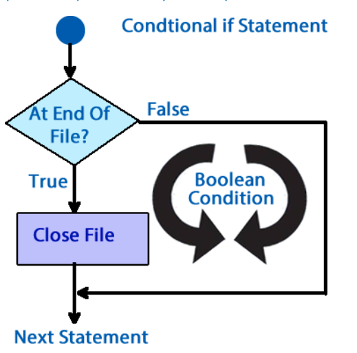
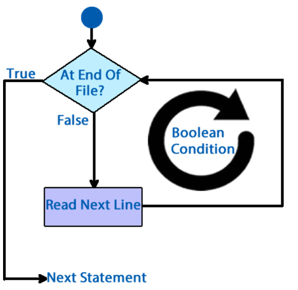
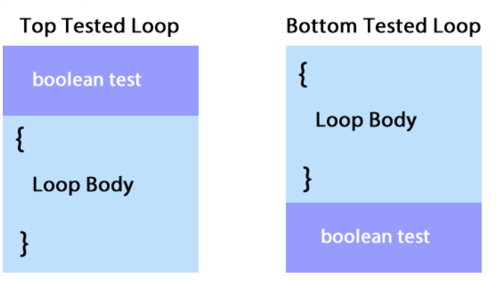
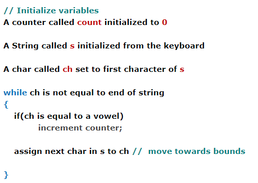
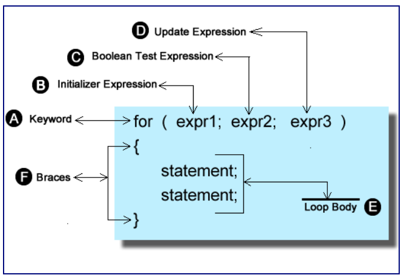
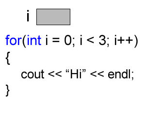
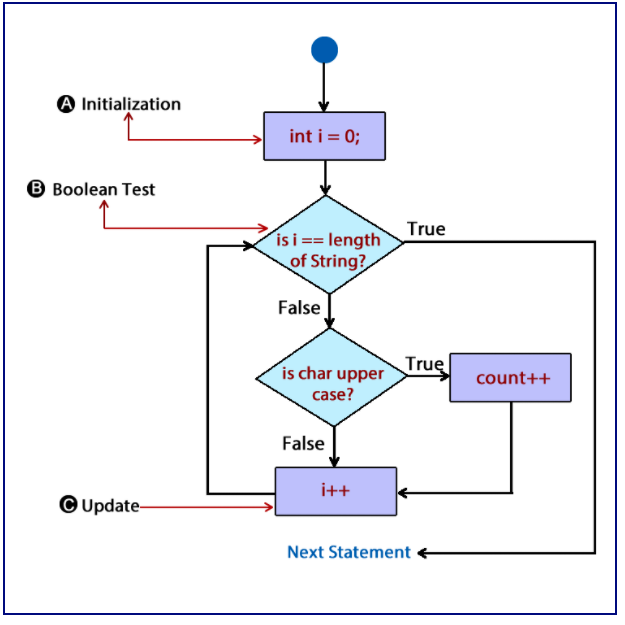

# Unit 6 - Repetition; For Loops

## Introducing Iteration

* Repetition, iteration, looping: What all of this really means is to repeat a set of statements until a certain condition is met
* Looping and decision structures are somewhat similar; both use relational operators to evaluate a boolean test condition and they both alter the flow of control of the program execution
  * The difference is that decision structures execute statements if true, and looping structures repeats a set of actions while true

* Decision executes the statements if the condition is true



* Iteration executes the statements repeatedly unntil the condition becomes false



### C++ and Iteration

* Three loop constructs
  * While
  * Do while
  * For



* Do-while: Has the test condition last
  * Will always execute at least one time
* While: Has the test condition first

### Loop Classification

* In C++ there are two types of loops:
  * Counted Loops
  * Indefinite Loops

* Counted loops are when you know how many times you want something to repeat
  * Outputting your name to the screen 10 times
  * You may not know the exact number, but you can consider reading lines from a file or counting the number of characters in a string

* Indefinite loops are when you cannot determine how many iterations the loop will need to execute to perform the task at hand
  * Example: Generate random numbers until a prime number is produced
    * Because the numbers are random, no way to tell how many numbers will be generated before a prime is found

* Indefinite loops can be broken down into three catagories
  * Data loops - Keep reading until there is no more data left to process. Can be used when reading the contents of a file or a web page
  * Sentinel loops - Keep iterating until a specific value or piece of data is found
  * Limit loops - Keep iterating until the answer is close enough. Best employed in scientific applications and graphing

### Writing loops correctly

* Doug Cooper's strategy for building loops
  * Preconditions
  * Actions the loop performs
  * Post conditions
  * Bounds
  * Goal

* Loop Bounds: What is needed to make your loops stop
  * Example: Count all the vowels that are present in a string
    * The bounds would be whenn the end of the string is encountered

* Loop Goal: Goal of the problem
  * From previous example: Goal is to count the number of vowels that appear in a string



### Precondition/Post condition

* Most loops will require some sort of precondition to set them up and get them going
  * From the example:
    * A counnter varaible was created to hold the number of vowels found
    * A string was declared and initialized to hold text from the keyboard
    * A character was created and initialized with the first character from the string s
  * A post condition could be that the loop was actually entered; to avoid possible divide by zero error

* Priming the loop: To start the loop
  * Many times you will need to initialize a variable with data before the loop, to avoid bounds errors

## The for loop

### Counted Loops

* All the statements that make up a for loop are located on the same line; easy to locate missing components
* Use this loop when you need to repeat a set of instructions a specific number of times



* The six components of a loop
  * Keyword for
  * Initialization section. The variable used to count
  * Boolean test condition. Used to make up the test
  * Update expression. Counter variable is changed to move the loop closer to the bounds
  * The loop body
  * Braces



```cpp
#include <iostream>
#include <string>

using namespace std;

int main()
{
   string s;
   cout << "Enter some text " << endl;
   getline(cin, s);

   int count = 0;
   for(int i = 0; i < s.length(); i++)
   {
      if(isupper(s.at(i)))
         count++;
   }
   cout << "You have " << count << " upper case chars " << endl;
   return 0;
}
```



* The bounds - When i becomes equal to the number of characters in the String
* The goal - Count the number of uppercase characters in the String

### The Initialization Section

* Typically used for variable creation to move the loop towards a bounds
  
```cpp
for (int i = 0;...;...)
{

}
```

* You are not limited to the creation of only one variable

```cpp
for (int i = 0, j = 1;...;...)
{

}
```

* All of the variables have to be the same type

### The Test Expression

* Happens right after the initialization section executes, before the update expression executes
* Test expression is created like you would create the test expression in an if statement

```cpp
for (int i = 0; i < 10;...)
{

}
```

* You can also use logical operators to construct a compounnd test expression

```cpp
for(int i = 0; i < 10 && j<=7;...)
{
   
}
```

* Cannot have multiple tests

### Update Expression

* Executes immediately after the loop body executes and just before the test expression
* Designed to change the counter variable which will move the loop towards its bounds

```cpp
for(int i = 0; i < 10; i++)
{
   
}
```

* Like the other components of the for loop you can have multiple test conditions

```cpp
for(int i = 0; i < 10; i++, j++)
{
   
}
```

### Counting Variations

* You are not limited to counting up; you can count down

```cpp
for(int i = 10; i >= 0; i--)
{
   
}
```

* You can count in steps, or exponentially

```cpp
for(int i = 0;i < 20, i+=2)
{
   
}

for(int i = 0;i < 10000, i*=i)
{
   
}
```

### Example Code - Sum of all characters

```cpp
#include <iostream>
#include <string>

using namespace std;

int main()
{
   string str;
   cout <<"Enter a string and I will sum all of the characters " << endl;
   getline(cin, str);

   int sum = 0;
   for(int i = 0; i < str.length(); i++)
   {
      sum+=static_cast<int>(str.at(i)));
   }
   cout << "The sum of all of the characters is " << sum << endl;
   return 0;
}
```

* Bounds - When the value of i reaches becomes equal to the number of characters in the string
* Accumulator - Incremented by the ascii value of the character each time through the loop

### Omitting Expressions

* You can use as many or as little of the sections of the loop as you would like

```cpp
for(int i = 2; i < 10000;  )
{
   
}
// A forever loop
for(; ;)
{
   
}
```
