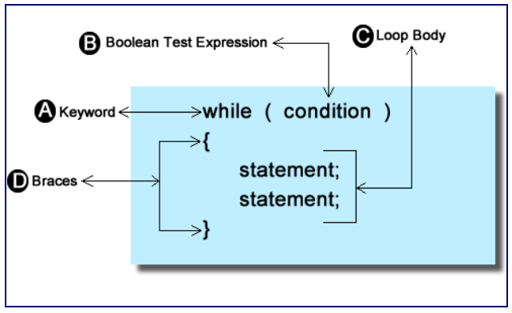
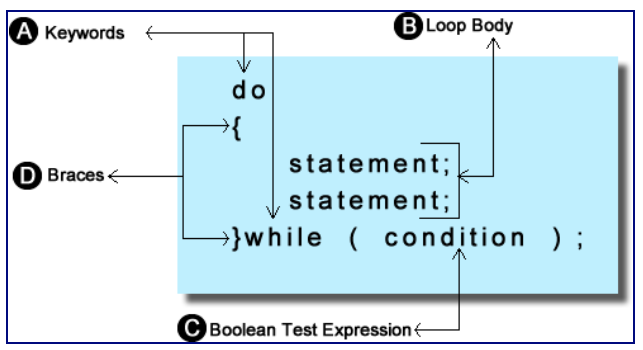
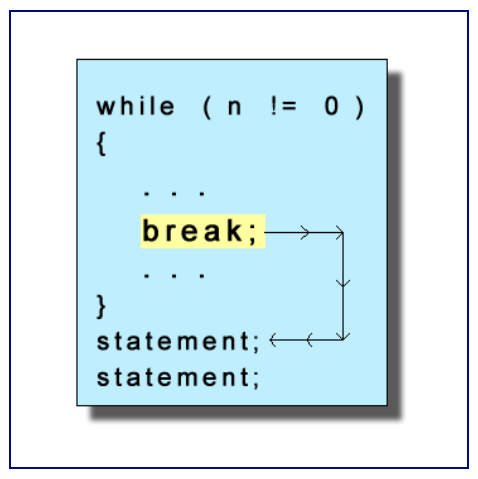
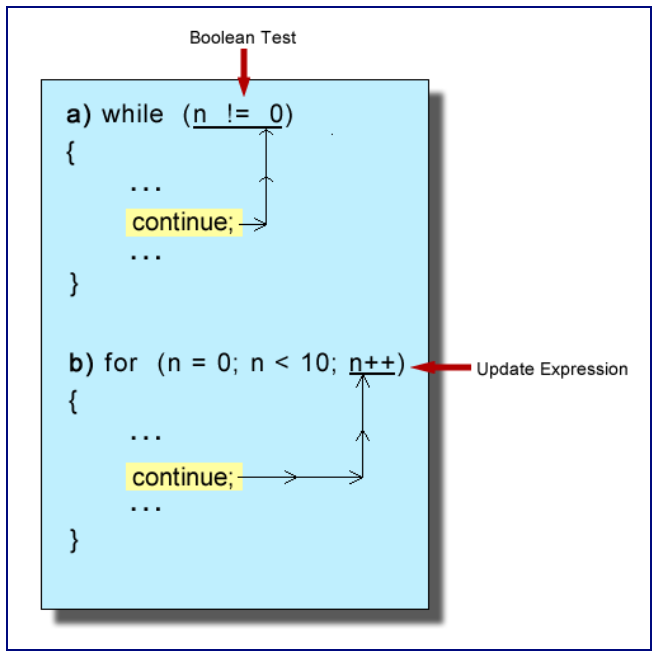

# Unit 7 - While loops

## Random Numbers

* Two function dedicated to creation of random numbers
  * srand() - seed the random number generator
  * rand() - generate a random number

* To generate a random number, simply call the function and assign what the function produces to a variable

```cpp
int someNumber = rand();
```

* Generates a number between 0 and a constant called RAND_MAX, defined in the header cstdlib
  * RAND_MAX is platform dependent but is guaranteed to be at least 32767 (16-bit value)

* To get a range, use the modulus operator

```cpp
int someNumber = rand() % 101;
```

* To get a number in the range of 0 to 100. Remember that if modulus was 100, it would output numbers 0 through 99 only

```cpp
int someNumber = rand() % 100 + 1;
```

* You get a value betweenn 0-99, and add one to get a value in the range of 1 to 100

```cpp
int main()
{
   int min = 10, max = 25;

   for(int i = 0; i < 100; i++)
   {
      int someNumber = rand() % ((max - min) + 1) + min;
   }
   return 0;
}
```

* Following code could give numbers in the range of min to max

### Psudeo-Random

* Random numbers in C++ are not actually random
  * If you were to run the code several times, the same random numbers would appear in the same order each time the program is run

* srand() function is a function that simply injects a value into the formula used to create a random number, seeding
  * Still repeats in the same order each time you run the program if you put a constant

* To solve the seeding problem you can incorporate one of the time functions
  * #include <ctime>

```cpp
#include <iostream>
#include <ctime> // Include ctime

using namespace std;

int main()
{
   srand(time(0)) //Seed the random number generator
   int min = 10, max = 25;

   for(int i = 0; i < 100; i++)
   {
      int someNumber = rand() % ((max - min) + 1) + min;
      cout << someNumber << endl;
   }
   return 0;
}
```

* Passing the parameter time_t into srand
  * Warning from the compiler that the conversion from time_t to unsigned int could produce possible loss of data
    * srand takes in int values, but time(0) produces time_t values
  * Can be fixed with casting
    * srand(static_cast(time(0)));

## The while Loops



* Constructed similar to an if-statement, but don't use a decision where you need to repeat statements and vice versa
* While loops can be constructed to solve a counting problem, initialize variables and increment/decrement them

### Counting Loops with while

```cpp
for (int i = 0; i < 10; i++)
{

}
int i = 0;
while (i < 10)
{
    i++;
}
```

* To use a while loop instead of a for loop
  * A counter variable is created and initialized before the loop starts. Precondition
  * The counter is tested inside the while condition
  * The counter updated inside of the body of the loop. Typically at the bottom of the loop. Closer to the bounds

* Common errors
  * The scope of the counter of the loop is limited to the body
    * Not true for variables defined outside of the block of the loop
  * Endless loops; counters don't get closer to the bounds
    * Build the loop first and test to see if it works before adding more statements in the body
  * Phantom semicolon (inserted after the while condition) statements in the body will never get executed

### Indefinite loops

```cpp
#include <iostream>
#include <ctime>

using namespace std;

int main()
{
   //seed the random number generator 
   srand(static_cast<unsigned int>(time(0)));

   int num;
   num = rand() % 100; // random number between 0 & 99

   while(num != 50)
   {
      cout << num << endl;
      num = rand() % 100; // reset num & try again
   }
   return 0;
}
```

* Bounds - When the value 50 is found
* Goal - To generate random numbers until the value 50 is found

* Sentinel Loop - Looks for some particular value as a way of terminating the repetiiton
  * Usually found in situations searching for text to find a particular word or character, or when looking for a value that marks the end of the input, like the end of a string

* Sentinel Ranges
  * Example: Read numbers from the keyboard until an even number is encountered. Output the sum and average of the odd numbers
    * Bound: When the number entered is an even number
    * Goal: Sum and get the avereage of the odd numbers 

```cpp
int main()
{
   int value;

   //Loop preconditions
   int sum = 0;
   int count = 0;

   //Prime the loop with the first number
   cout << "Enter a number " << endl;
   cin >> value;

   while(value % 2 != 0)
   {
      sum+=value;
      count++;

      //Move towards the bounds
      cout << "Enter a number " << endl;
      cin >> value;
   }

   if(count > 0)
   {
      cout << "The sum of the odd numbers is " << sum << endl;
      cout << "The average value is " + sum / count << endl;
   }
   else
   {
      cout << "No odd numbers entered" << endl;
   }
   return 0;
} 
```

* Preconditions
  * count - keep track of the number of odd number input
  * value - created and initalized with input from the keyboard
  * sum - to accumulate the sum of all of the odd numbers

* Post Condtions
  * Make sure that at least one odd number was entered; if not, the loop would not be entered and a divide by zero error would occur
    * Check the value of count before any division takes place

### Primed Loops

* Setting up the first value before the loop is entered
  * In the example, input is taken from the keyboard to allow the loop to start working with the proper first value

```cpp
int main()
{
   char answer;

   //Prime the loop
   cout << "Would you like to play (y/n) ? " << endl;
   cin >> answer;

   while(toupper(answer) == 'Y')
   {
      cout << "Would you like to play again (y/n) ? " << endl;
      cin >> answer;
   }
   return 0;
}
```

* Loop repeats until the answer is anything other than 'Y'
  * If ```cin >> answer``` was not in the body, the answer would not change and the loop becomes infinite

### Bottom testing - The do-while Loop



* The test is at the bottom meaning that the loop body will always be executed one time
* Note that at the end of the condition statement there is a semicolon
  
## Jumps in C++

* In early days of programming, before high level programming languages provided constructs for selection and iteration, programming languages used jumps as a way to have selection and looping statements
  * The C++ language has a jump statement, goto, but is frowned upon by most programmers; using it too often created "spaghetti code" that jumped all over the place

### The break statement



* The break statement forces the flow of the code to jump past the closing brace of the loop it is contained within
  * In a nested loop, will only force the code to break out of the loop it is in; if in an inner loop, it will break out of the inner loop only

```cpp
int main()
{
   srand(static_cast<unsigned int> (time(0)));

   int num = 0, i;
  
   num = rand() % 101;
   for(i = 0; i < 100; i++)
   {
      if(num == 50)
         break;
      cout << "The random number is " << num << endl;
      num = rand() % 101;
   }

   if(i < 100)
      cout << "The number 50 was encountered at iteration " << i << endl;
   else
      cout << "The number 50 did not come up" << endl;

   return 0;
}
```

### The continue statement

* Used to force the flow of the program to branch back to the top of the loop



* While loop: The continue statement will force the flow of the program to branch back to the top of hte loop where the Boolean test condition will be immediately executed
* For loop: The continue statement will force the flow of the program to branch back to the top of the loop where the update expression is executed

```cpp
int main()
{
   char c;
   int sum = 0;

   for(int i = 0; i < 10;)
   {
      cout << "Enter and integer to sum " << endl;
      cin >> c;

      if(!isdigit(c))
         continue;
  
      sum+= static_cast<int>(c - '0');
      i++;
   }
   cout << The sum of the digits entered is " << sum << endl;
   return 0;
}
```
