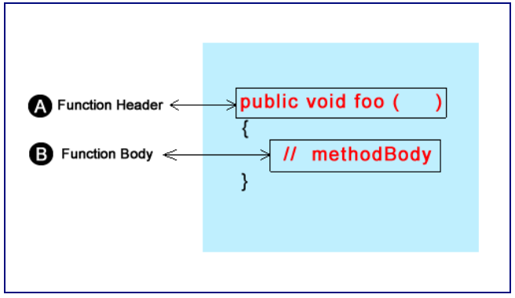

# Unit 9 - Functions

## Predefined Functions

* C++ provides some functionality that you can use to make writing programs easier
  * cin and cout are functions of the standard library

* Think of a function as a black box; you don't need to know how the function works to use it
  * This is called encapsulation, hiding the details from the user

```cpp
double root;
root = sqrt(25.0);
```

* The sqrt function is called with the value of 25 being passed to it, the function will then return 5
  * Control of the program branches to where the function resides in memory after being invoked
  * A function like everything in C++ sits somewhere in memory, but we don't need to know where it is, just refer to the spot by its name i.e. sqrt
  * sqrt refers to the address, sqrt() makes the program branch to where the function is in memory, put information in the parentheses to pass it
  * The sqrt function is part of the cmath library, and it must be included before you can call any of the functions from it

```cpp
int x = 2;
int square, cube;

square = x * x;
// Can also use the pow function
square = pow(x, 2.0);
// Can put any power, including cube
cube = pow(x, 3.0);
```

```cpp
#include <iostream>
#include <cmath>

using namespace std; 

int main()
{
int numLoop;

    cout << "Enter the number of iterations ";
    cin >> numLoop;
    for(int i = 0; i < numLoop; i++)
    {
      cout << "The square of " << i << "is " << pow(i, 2.0) << endl;
      cout << "The cube of " << i << " is " << pow(i, 3.0) << endl;
      cout << "The sqrt of " << i << " is "<< sqrt(static_cast<double>(i)) << endl;
    } 

    return 0; 

}
```

* pow is an overloaded function; not properly specifying the parameters can lead to ambiguity
  * One of the overloads for pow takes 2 doubles, so by casting one of them the compiler knows to turn the other parameter into a double as well

* Useful math functions that are a part of the standard library
  * sqrt()
    * Square root
  * pow()
    * Power
  * abs()
    * Absolute value
  * labs()
    * Absolute value of long
  * fabs()
    * Absolute value of float
  * ceil()
    * Ceiling (round up)
  * floor()
    * Floor (round down)

* Other standard library functions
  * exit()
    * End program
  * rand()
    * Random number
  * srand()
    * Seed random number

### Function Arguments

* Data passed to functions are called the function arguments; also can be known as parameters
  * Each of the arguments that are passed must have a type
  * You can pass parameters as a literal or a variable
  * Some functions will have mixed parameters

* Void type
  * Some functions don't return anything; they have a void return type
  * It is needed because the compiler needs a definition of the function before you can use it; to make all functions similar (have a return type) void is used to indicate to return nothing

* Look at the standard library before you go off and try to write a function to do a task

## Simple Functions

* The concept of functions can be found in other programming languages; methods, procedures, sub-routines
  * You can think of functions as sub programs that allow you to organize your code in a logical fashion

* When you write piece of software, it's for solving a problem
  * Breaking down large problems into smaller ones is called step-wise refinement

* A function may need additional information before they can be used, but others can be invoked on their own



* The function header consists of the return type, name of the function, parentheses, and optionally information that goes inside the parentheses

* Return Type - All functions must have a return type. If it doesn't return anything, you need to use the keyword void. You can return any valid C++ type from a function; you can return your own custom types
* Function Name - Follow the same rules for naming variables
* Formal Parentheses - Formal parameters must be enclosed in parentheses; leave it empty if it doesn't need any paremeters. Multiple parameters are separated by commas

```cpp
#include <iostream>

using namespace std;

void helloWorld();

int main()
{
   helloWorld();
   return 0;
}
void helloWorld()
{
   cout << "Hello World" << endl;
}
```

* The line of code right below the std namespace is called a function prototype. It is required or else you will get a compilation error
  * A compiler needs to see a definition before it can be used
  * Make sure to include the semicolon; it is needed or the compiler will get confused trying to look for curly braces after the parentheses

* There are two ways a program can branch to where it came from
  * When the closing brace of the function is reached
  * With the return statement

```cpp
void helloWorld()
{
   cout << "Hello World" << endl;
   //Forces the flow of the program to branch back 
   // to where it came from
   return;
}
```

* Function prototypes are not really defintions, since there's no body, but it does define the inputs and outputs to a function and the information must be seen by the compiler before the function can be used